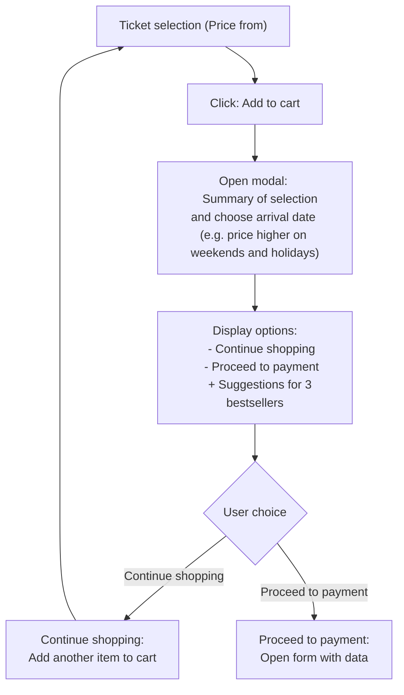
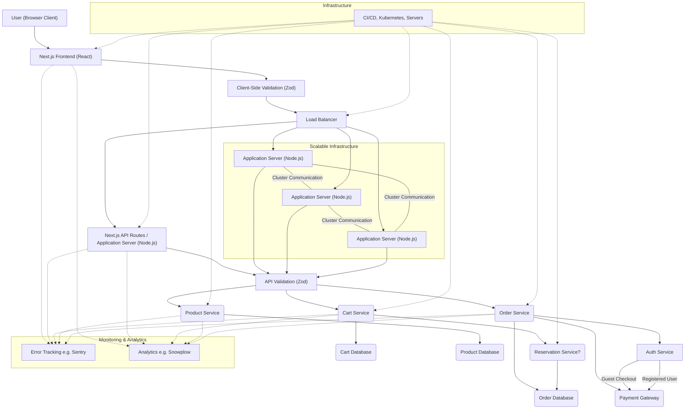

# Burger Land - Plan Your Day

**An application for planning your visit to Burger Land, allowing you to purchase tickets and additional services.**

## Installation and Running

1. Clone the repo: `git clone https://github.com/MKuplowski/burger-land`
2. Go to directory: `cd burger-land`
3. Install dependencies: `pnpm install`
4. Run: `pnpm run dev`
5. Open in your browser: [http://localhost:3000](http://localhost:3000)

## Technologies

*   **Next.js** with **App Router** - A fast and convenient **React** framework with react-compiler installed.
*   **TypeScript**
*   **Tailwind CSS** - Rapid styling
*   **`@tanstack/react-query`** - Data fetching, caching, optimistic updates
*   **`zod`** - Data validation
*   **`next-intl`** - Internationalization
*   **`cookies-next`** - `cartId` in cookies.
*   **`cypress`** - E2E testing.

## Project Structure

Key folders:

*   `app` - Main application code (Next.js App Router).
    *   `[locale]` - Language support.
    *   `api` - API routes (mocked data).
    *   `modules` - Business logic (e.g., cart).
*   `components` - Reusable UI components. - TODO: storybook and separate to package
*   `cypress` - E2E tests.
*   `i18n` - Internationalization config.
*   `messages` - Translation files.
*   `shared` - Shared types, schemas, mocks, endpoints, etc.

## API (Mocked)

| Method | Endpoint                           | Description                                                                        |
| ------ | ---------------------------------- | ---------------------------------------------------------------------------------  |
| GET    | `/api/products`                    | Gets products (tickets and bestsellers).                                           |
| GET    | `/api/cart/:cartId`                | Gets the cart (`cartId` from cookie).                                              |
| POST   | `/api/cart/:cartId/items`          | Adds a product to the cart (`cartId` from cookie, body: `AddToCartSchema`).        |
| PUT    | `/api/cart/:cartId/items/:itemId]` | Updates quantity in the cart.                                                      |

More details (Zod schemas): `shared/schemas.ts`.

## Decisions

*   **`cartId` in cookies:** We don't want to store cart data locally, instead we store `cartId` in cookies and fetch cart data from the server - this allows to keep the cart without logging in and merging carts if user logs with filled cart, and also possible to analyze cart abandonment and other metrics.
*   **Mocked API:** Just to be able to work on the frontend without real database - simplicity.
*   **`react-query`:** Convenient API data management.

## Known Issues

*   **Incomplete Cart Functionality:** The UI currently lacks the ability to **remove items** from the cart.
*   **No Family Pricing:** The application does not yet implement any logic for **family ticket discounts** (at the moment it is a separate Family Ticket).
*   **Basic Attraction Purchase Flow:** The current flow for adding attractions to the cart is very basic. It needs a more **user-friendly and engaging flow**, including detailed attraction information and a more intuitive way of adding them to the cart, but I decided that this is not the essence of the task.
*   **More tests**
*   **A few things to improve** (see TODOs in the code).

## Future Improvements

### Monitoring & Security
* **User Behavior Analytics:** Implementation for cart abandonment analysis and conversion tracking
* **Error Tracking:** Integration for real-time client-side error monitoring and performance metrics
* **Feature Management:** Feature flags, A/B testing

# Diagrams show the suggested final flow - a plan of how it should look like - the application structure may differ from the one in the diagrams due to the time constraints of implementation.

---

**Flow Diagram:**

---

**Architecture Diagram:**

---