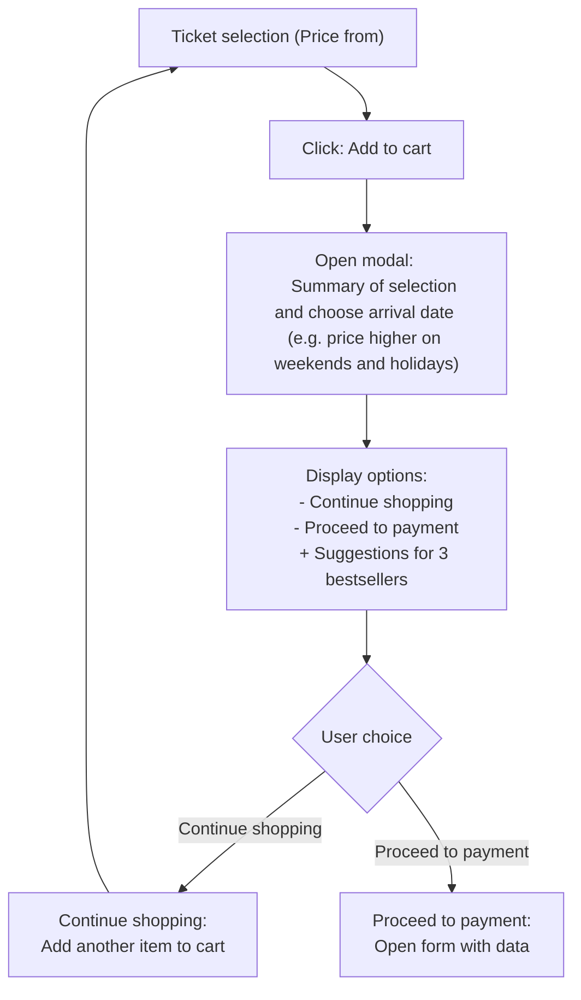
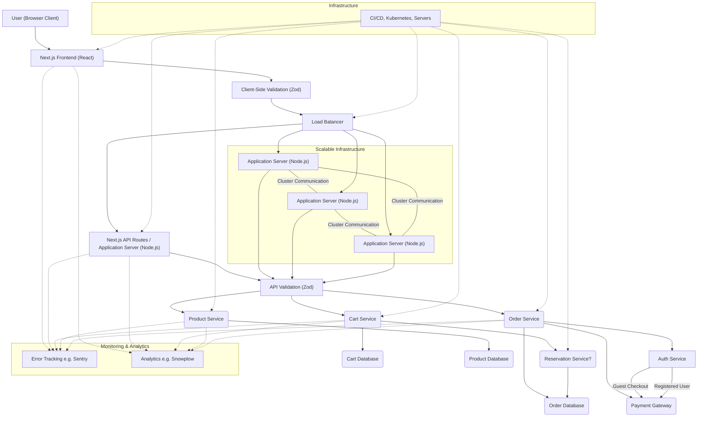

# Burger Land - Plan Your Day

**An application for planning your visit to Burger Land, allowing you to purchase tickets and additional services.**

## Installation and Running

1. Clone the repo: `git clone <repository_address>`
2. Go to directory: `cd burger-land`
3. Install dependencies: `pnpm install`
4. Run: `pnpm run dev`
5. Open in your browser: [http://localhost:3000](http://localhost:3000)

## Technologies

*   **Next.js** with **App Router** - A fast and convenient **React** framework.
*   **TypeScript**
*   **Tailwind CSS** - Rapid styling
*   **`@tanstack/react-query`** - Data fetching, caching, optimistic updates
*   **`zod`** - Data validation
*   **`next-intl`** - Internationalization
*   **`cookies-next`** - `cartId` in cookies.
*   **`cypress`** - E2E testing.

## Project Structure

Key folders:

*   `app` - Main application code (Next.js App Router).
    *   `[locale]` - Language support.
    *   `api` - API routes (mocked data).
    *   `modules` - Business logic (e.g., cart).
*   `components` - Reusable UI components. - TODO: storybook and separate to package
*   `cypress` - E2E tests.
*   `i18n` - Internationalization config.
*   `messages` - Translation files.
*   `shared` - Shared types, schemas, mocks, endpoints, etc.

---

**Flow Diagram:**

---

**Architecture Diagram:**

---